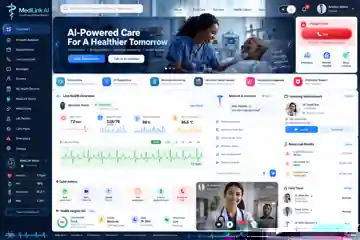
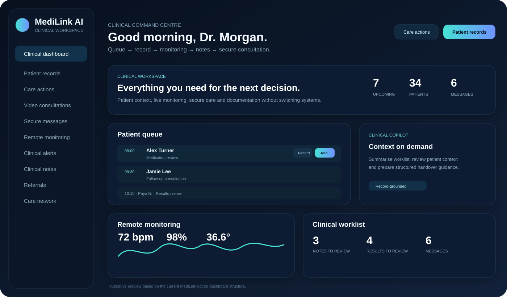
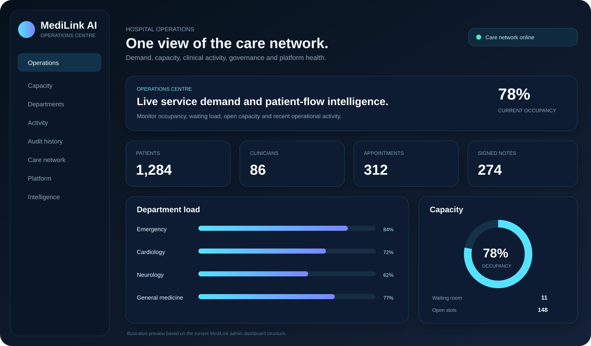
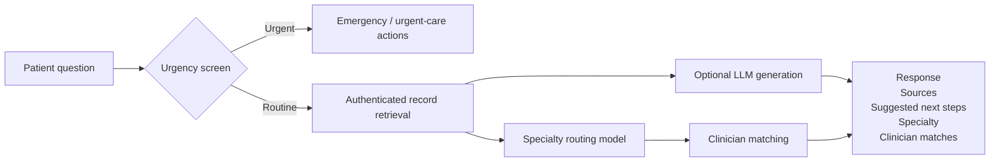
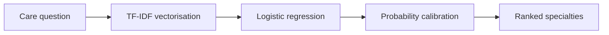
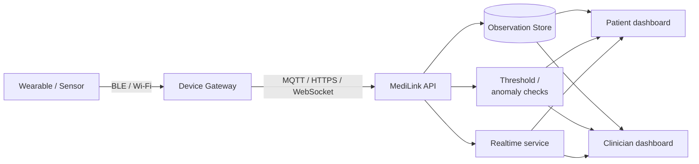
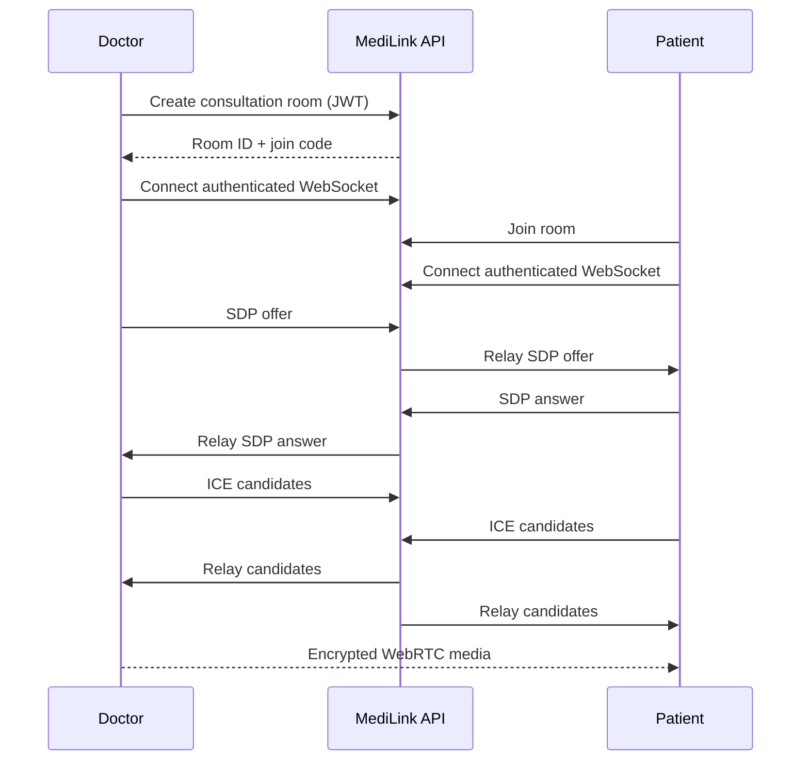
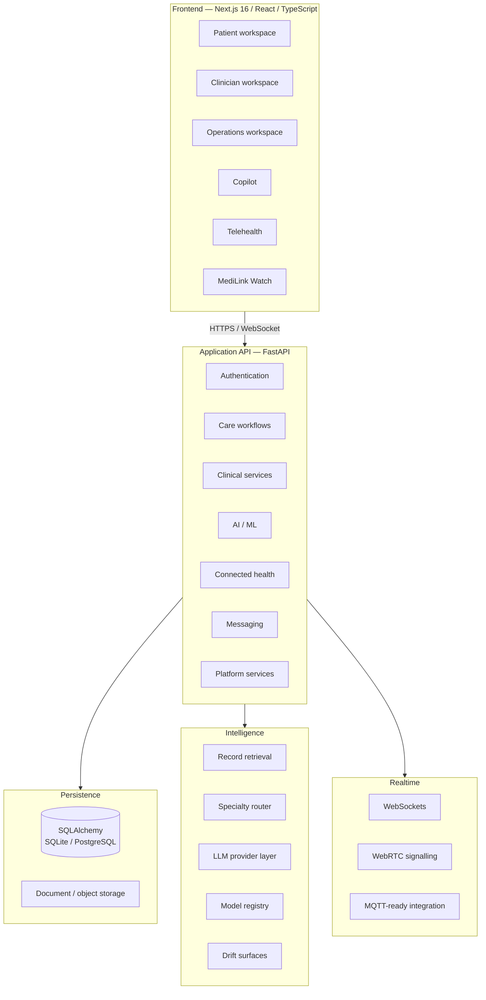
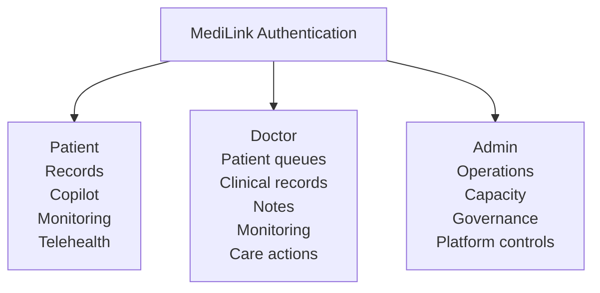

<div align="center">



<br />

# MediLink AI

### Healthcare systems engineering across clinical workflows, AI, telehealth and remote monitoring.

**MediLink is a full-stack healthcare platform built around one idea: clinical context should not disappear when a patient moves between records, appointments, monitoring, messaging and consultation.**

[](https://medilink-ai-eight.vercel.app)
[](https://medilink-ai-api.onrender.com/docs)
[](https://medilink-ai-api.onrender.com)

<br />


**[Live Demo](https://medilink-ai-eight.vercel.app)** · **[API Docs](https://medilink-ai-api.onrender.com/docs)** · [Architecture](#system-architecture) · [AI & ML](#intelligence-layer) · [Run Locally](#running-locally)

</div>

---

## What is MediLink?

Healthcare software often fragments a single care journey across unrelated systems.

Appointments live in one product. Records in another. Video consultations somewhere else. Remote monitoring arrives through a separate dashboard, while AI tools often operate without access to meaningful patient context.

MediLink explores what happens when those capabilities are designed as parts of the same system.

The platform provides separate workspaces for:

| Patient | Clinician | Operations |
|---|---|---|
| Appointments | Patient queues | Capacity |
| Health records | Clinical records | Patient flow |
| Medications | Remote monitoring | Department load |
| Laboratory results | Clinical actions | Facility status |
| Connected vitals | Consultation rooms | Audit history |
| Telehealth | Documentation | Platform controls |
| Secure messaging | Referrals | AI governance |
| MediLink Copilot | Clinical Copilot | Operational analytics |

The goal is not to create another chatbot with a healthcare interface.

The goal is to model a **connected healthcare system** where identity, clinical information, realtime communication, monitoring and decision-support operate against the same underlying context.

---

# Platform

## Patient workspace

The patient application acts as the central point for managing care.


Patients can access:

- upcoming appointments
- health records
- medication information
- laboratory results
- clinical timeline events
- uploaded documents
- connected-health observations
- monitoring alerts
- clinician discovery
- appointment booking
- secure messaging
- browser-based consultations
- MediLink Copilot
- emergency support controls

Rather than treating these as disconnected modules, the dashboard brings them into a single authenticated patient context.

---

## Clinician workspace



The clinician interface follows the way clinical work actually progresses:

```text
Patient Queue
     ↓
Clinical Record
     ↓
Remote Monitoring
     ↓
Care Action
     ↓
Consultation
     ↓
Clinical Documentation
```

Clinicians can work with:

- scheduled consultations
- active patient queues
- patient histories
- monitoring observations
- clinical alerts
- care actions
- SOAP-style documentation
- referrals
- laboratory workflows
- medication workflows
- secure messaging
- video consultations
- record-grounded clinical assistance

The authenticated clinician session determines what information and actions are available.

---

## Hospital operations



The administrative workspace focuses on the system around clinical care rather than the individual consultation.

It exposes operational views for:

- patient and clinician activity
- appointment volume
- signed clinical notes
- facility capacity
- waiting-room activity
- department workload
- appointment availability
- patient flow
- care-network status
- audit history
- platform controls
- model and governance surfaces

This layer is intended to show how clinical applications can connect to hospital-level operational intelligence rather than stopping at the patient portal.

---

# Core capabilities

| Capability | Implementation |
|---|---|
| **Clinical records** | Patient timeline, labs, medications, documents and clinical events |
| **Appointments** | Clinician discovery, matching, booking and appointment management |
| **AI assistance** | Record-grounded patient and clinician Copilot |
| **ML routing** | Specialty classification from care questions |
| **Doctor matching** | Explainable clinician ranking score |
| **Telehealth** | WebRTC consultation rooms with authenticated signalling |
| **Connected care** | Streamed observations, monitoring state and alert surfaces |
| **Clinical documentation** | SOAP-style notes and signed-note tracking |
| **Laboratory workflows** | Orders, results and review surfaces |
| **Medication workflows** | Medication records and prescribing-oriented interfaces |
| **Referrals** | Referral creation, tracking and operational queues |
| **Messaging** | Patient/clinician communication workspace |
| **Interoperability** | FHIR R4-style resource endpoints |
| **Authentication** | JWT sessions and Google Identity support |
| **Authorization** | Patient, Doctor and Admin roles |
| **Realtime systems** | WebSockets and WebRTC signalling |
| **Governance** | Audit history, model registry and drift surfaces |

---

# Intelligence layer

MediLink does not route every healthcare problem through one language model.

Different problems are handled by different components.



This separation matters.

Emergency escalation, information retrieval, specialty classification, clinician ranking and natural-language generation are not the same engineering problem and should not share the same level of authority.

---

## Record-grounded Copilot

The Copilot is designed to retrieve information from the authenticated user's MediLink context before generating an answer.

That context can include:

```text
Patient
├── Appointments
├── Medications
├── Laboratory results
├── Clinical timeline
├── Referrals
├── Monitoring observations
├── Documents
└── Previous MediLink conversations
```

Typical workflows include:

- explaining recorded laboratory information
- reviewing medication context
- preparing a patient for an appointment
- summarising relevant record history
- reviewing referrals
- identifying an appropriate clinical specialty
- surfacing potential clinicians
- continuing previous conversations with context

A response can include more than generated text.

```json
{
  "answer": "...",
  "sources": [],
  "highlights": [],
  "next_steps": [],
  "suggested_specialties": [],
  "clinician_matches": [],
  "urgency": "...",
  "model_metadata": {}
}
```

That distinction is intentional: **the system should be able to show what information informed the response.**

---

# Specialty routing model

MediLink includes a dedicated text-classification pipeline for routing care questions to clinical specialties.

### Pipeline



The current model covers **10 specialties**.

### Evaluation

| Metric | Test result |
|---|---:|
| Accuracy | **93.85%** |
| Macro F1 | **93.98%** |
| Weighted F1 | **93.92%** |
| Top-2 accuracy | **95.38%** |
| Log loss | **0.5805** |
| Test examples | **65** |
| Specialties | **10** |

These values are development metrics measured against synthetic/test examples.

They demonstrate the behaviour of the engineering pipeline; they are **not evidence of clinical performance**.

---

# Clinician matching

Specialty classification feeds a clinician-ranking layer.

Instead of presenting the result as an opaque prediction, MediLink generates a transparent fit score:

```text
Clinician Match
─────────────────────────────
Specialty alignment       +
Availability              +
Relevant attributes       +
Platform ranking signals
─────────────────────────────
Fit Score                  /100
```

The score is used for ranking.

It is **not**:

- a diagnosis
- a clinical probability
- a probability of successful treatment
- a substitute for professional judgement

---

# MediLink Watch

MediLink Watch models the connected-health part of the platform.

The system can handle observations including:

```text
Heart rate
SpO₂
Temperature
Blood pressure
Activity / step count
Device battery
Monitoring state
Threshold alerts
Anomaly alerts
```

For development, the backend can generate observations to exercise the monitoring pipeline without requiring a physical sensor.

Generated observations are kept conceptually separate from real device readings.

### Intended device path



The architecture is prepared for a future physical-device gateway without pretending that simulated development data originated from medical hardware.

---

# Telehealth

MediLink includes browser-based consultation rooms using WebRTC.

The implementation covers:

- authenticated room creation
- room identifiers
- join codes
- browser camera access
- browser microphone access
- WebRTC peer connections
- SDP negotiation
- ICE candidate exchange
- authenticated WebSocket signalling
- participant state
- microphone controls
- camera controls
- call termination

### Signalling flow



The development configuration uses STUN-based connectivity.

A hardened deployment would additionally require TURN infrastructure and stronger room-scoped authorization and lifecycle controls.

---

# Clinical workflows

MediLink extends beyond scheduling and video calls.

## Documentation

```text
Patient
  ↓
Consultation
  ↓
Clinical Note
  ↓
Review
  ↓
Signed Note
```

Supported concepts include:

- SOAP-style notes
- note review
- signed-note tracking
- clinical letters

## Laboratory workflow

```text
Clinician
   ↓
Lab Order
   ↓
Result
   ↓
Clinical Review
   ↓
Patient Record
```

## Medication workflow

The platform contains interfaces and data structures for:

- medication lists
- prescribing-oriented workflows
- medication review
- patient medication views

## Referral workflow

```text
Referral created
      ↓
Referral queue
      ↓
Operational handling
      ↓
Patient visibility
```

## Clinical worklists

Clinicians can work against:

- monitoring alerts
- risk surfaces
- care actions
- patient queues
- pending clinical work

---

# System architecture

MediLink uses a service-oriented full-stack architecture rather than placing application logic entirely inside the frontend.



---

# Technology

### Frontend

```text
Next.js 16
React
TypeScript
Lucide React
WebRTC browser APIs
WebSocket browser APIs
Responsive application UI
```

### Backend

```text
Python
FastAPI
Pydantic
SQLAlchemy
JWT authentication
Google Identity verification
WebSockets
Document/PDF processing
Background-job interfaces
```

### Machine learning

```text
TF-IDF
Logistic Regression
Probability calibration
Record-grounded retrieval
Clinician-ranking logic
Model registry
Drift/governance surfaces
Optional LLM provider abstraction
```

### Infrastructure

```text
Vercel
Render
Docker
Docker Compose
PostgreSQL-ready persistence
Redis-ready services
MQTT-ready device integration
```

---

# Data and platform layer

The persistence layer is built on SQLAlchemy, allowing local development against SQLite while keeping the data model compatible with PostgreSQL-oriented deployment.

The wider platform design includes:

- SQLAlchemy persistence
- PostgreSQL configuration
- SQLite development fallback
- Redis configuration
- in-process fallback behaviour
- background-job interfaces
- object-storage abstraction
- migration-ready structure
- model registry
- model drift surfaces
- platform-health endpoints

---

# Interoperability

MediLink includes a FHIR R4-style patient resource endpoint.

```http
GET /api/v1/fhir/Patient/{patient_id}
```

This is the starting point for a wider interoperability layer.

Planned expansion includes:

```text
Patient
Observation
Medication
DiagnosticReport
Appointment
Practitioner
Encounter
Referral / ServiceRequest
```

The project does not claim full FHIR conformance at its current stage.

---

# Authentication and authorization

MediLink supports both traditional authentication and external identity foundations.



Current authentication features include:

- email/password registration
- password hashing
- JWT access sessions
- protected API routes
- Google Identity token verification
- external identity-linking foundation
- role-based application access

The standard registration endpoint does **not** permit self-registration as an administrator.

---

# Security model

Security work is separated into what exists today and what a real healthcare deployment would still require.

| Implemented | Production hardening |
|---|---|
| Password hashing | Formal threat modelling |
| JWT authentication | Penetration testing |
| Role-protected routes | Managed key infrastructure |
| Authenticated API endpoints | Formal data-retention policy |
| Google token verification | Periodic access reviews |
| Protected consultation-room creation | Regulatory assessment |
| Authenticated WebSocket signalling | Independent security validation |
| Audit-history support | Full security monitoring |
| Explicit origin configuration | Production secrets infrastructure |
| Backend-only secret storage | Incident-response processes |

---

# Healthcare safety boundaries

MediLink is a software engineering project, not a certified medical system.

The application follows several design boundaries.

### 1. AI is advisory

Generated responses assist users with navigating information. They do not replace clinicians.

### 2. Emergency handling is outside the LLM

Urgent escalation is handled separately from generative output.

For UK-oriented flows, the interface can direct users toward:

- **999** for emergencies
- **NHS 111** for urgent medical advice

### 3. Routing scores are not diagnoses

Specialty routing and clinician ranking are navigation mechanisms.

### 4. Development metrics are labelled as development metrics

Machine-learning evaluation results are not presented as clinical validation.

### 5. Synthetic device observations remain synthetic

Simulated monitoring data must never be represented as data captured from physical medical hardware.

### 6. Record information and generated information remain distinguishable

The architecture is designed to preserve provenance wherever practical.

### 7. Emergency actions remain explicit

The system does not silently initiate emergency decisions through an LLM.

> **MediLink AI has not undergone clinical validation or medical-device certification and must not be used for real-world diagnosis, treatment or emergency decision-making.**

---

# Deployment

The application is currently split across two deployed services.

| Component | Deployment | URL |
|---|---|---|
| Frontend | Vercel | https://medilink-ai-eight.vercel.app |
| API | Render | https://medilink-ai-api.onrender.com |
| OpenAPI documentation | Render | https://medilink-ai-api.onrender.com/docs |

The Render service may cold-start on lower-tier hosting, so the first request can take longer than subsequent requests.

---

# Running locally

## Requirements

Install:

```text
Python 3.11+
Node.js 18+
Git
```

## 1. Clone the repository

```bash
git clone https://github.com/Edgar-50/medilink-ai.git
cd medilink-ai
```

## 2. Start the backend

### Windows / PowerShell

```powershell
cd backend

python -m venv .venv

.\.venv\Scripts\python.exe -m pip install -r requirements.txt
```

Create:

```text
backend/.env
```

Example:

```env
DATABASE_URL=sqlite:///./medilink.db
SECRET_KEY=replace-with-a-secure-random-secret
ACCESS_TOKEN_EXPIRE_MINUTES=60

FRONTEND_ORIGIN=http://localhost:3000

GOOGLE_CLIENT_ID=your-google-client-id
```

Start FastAPI:

```powershell
.\.venv\Scripts\python.exe -m uvicorn app.main:app --reload --reload-dir app
```

Backend:

```text
http://127.0.0.1:8000
```

OpenAPI:

```text
http://127.0.0.1:8000/docs
```

## 3. Start the frontend

Open another terminal:

```powershell
cd frontend
npm.cmd install
```

Create:

```text
frontend/.env.local
```

Example:

```env
NEXT_PUBLIC_API_URL=http://127.0.0.1:8000
NEXT_PUBLIC_GOOGLE_CLIENT_ID=your-google-client-id
```

Run:

```powershell
npm.cmd run dev
```

Open:

```text
http://localhost:3000
```

---

# Optional LLM configuration

LLM credentials belong on the backend only.

```env
LLM_PROVIDER=openai
OPENAI_API_KEY=your-secret-key
OPENAI_MODEL=your-enabled-model

LLM_ALLOW_RECORD_CONTEXT=true
LLM_TIMEOUT_SECONDS=30
```

Do not expose provider secrets through variables beginning with:

```text
NEXT_PUBLIC_
```

If no provider is configured, portions of MediLink can use deterministic or record-grounded fallback behaviour where implemented.

---

# Docker

A Docker-based development environment is also available.

```bash
docker compose up --build
```

Depending on the selected Compose configuration, the stack can include:

```text
MediLink API
PostgreSQL
Redis
MQTT
```

---

# Repository structure

```text
medilink-ai/
│
├── backend/
│   ├── app/
│   │   ├── core/
│   │   │   ├── configuration
│   │   │   ├── database
│   │   │   └── security
│   │   │
│   │   ├── models/
│   │   ├── routers/
│   │   ├── schemas/
│   │   └── services/
│   │
│   ├── ml/
│   │   └── artifacts/
│   │
│   ├── storage/
│   ├── requirements.txt
│   └── .env.example
│
├── frontend/
│   ├── app/
│   │   ├── dashboard/
│   │   │   ├── patient/
│   │   │   ├── doctor/
│   │   │   └── admin/
│   │   │
│   │   ├── copilot/
│   │   ├── video/
│   │   ├── watch/
│   │   ├── records/
│   │   ├── labs/
│   │   └── medications/
│   │
│   ├── components/
│   └── lib/
│
├── docs/
│   ├── screenshots/
│   └── architecture/
│
├── docker-compose*.yml
└── README.md
```

---

# Engineering status

| System | Status |
|---|:---:|
| Next.js production frontend | ✅ |
| FastAPI API | ✅ |
| Patient dashboard | ✅ |
| Clinician dashboard | ✅ |
| Operations dashboard | ✅ |
| Email/password authentication | ✅ |
| Google sign-in | ✅ |
| Role-based access | ✅ |
| Appointment workflows | ✅ |
| Record-grounded Copilot | ✅ |
| Specialty routing model | ✅ |
| Clinician matching | ✅ |
| WebRTC consultation rooms | ✅ |
| Authenticated WebSocket signalling | ✅ |
| Connected-health dashboard | ✅ |
| Messaging workflows | ✅ |
| Clinical workflow surfaces | ✅ |
| Platform administration | ✅ |
| FHIR-style Patient endpoint | ✅ |
| Production TURN infrastructure | Planned |
| Physical wearable integration | Planned |
| Formal clinical validation | Not performed |
| Medical-device certification | Not claimed |

---

# Roadmap

## Platform

- production PostgreSQL persistence
- hardened migrations
- Redis-backed distributed state
- durable object storage
- stronger observability
- structured audit events
- production secrets management

## Telehealth

- TURN infrastructure
- room-scoped authorization
- consultation lifecycle policies
- reconnection handling
- session telemetry

## Connected health

- real sensor gateway
- BLE ingestion
- MQTT device pipeline
- device identity
- device-health monitoring
- configurable clinical thresholds

## Intelligence

- richer clinical-context retrieval
- improved source traceability
- structured clinical summarisation
- evaluation pipelines
- model-version comparison
- drift dashboards
- clinician-configurable safety rules

## Interoperability

- additional FHIR-style resources
- terminology mappings
- structured import/export
- external EHR adapters

## Security

- formal threat model
- penetration testing
- managed keys
- access-review workflows
- audit retention
- security-event monitoring

---

# Design principles

Several rules guide the project.

```text
Clinical context > isolated features

Retrieval before generation

Deterministic safety > generative safety

Explainable ranking > opaque scoring

Role-specific interfaces > one dashboard for everyone

Realtime state > manual refresh

Interoperability > closed data models

Auditability > invisible automation

Explicit limitations > inflated claims
```

---

# Why I built it

MediLink is primarily an engineering study in how several difficult software domains interact inside one product:

- full-stack web engineering
- healthcare workflow modelling
- authentication and authorization
- relational data modelling
- machine learning
- LLM orchestration
- realtime communication
- WebRTC
- WebSockets
- IoT architecture
- interoperability
- security
- cloud deployment
- operational monitoring

The interesting part of the project is not any single feature.

It is the integration boundary between them.

A telehealth room becomes more useful when it understands the appointment that created it.

A monitoring alert becomes more useful when the clinician can immediately reach the patient's record.

An AI assistant becomes safer when it can distinguish stored facts from generated information.

A clinician recommendation becomes more trustworthy when its ranking logic is explicit.

That is the system MediLink is designed to explore.

---

# Project boundaries

MediLink deliberately distinguishes between:

| Engineering concept | Not equivalent to |
|---|---|
| Prototype | Production healthcare system |
| Synthetic observations | Medical-device measurements |
| ML test performance | Clinical evidence |
| Clinician ranking | Treatment recommendation |
| AI assistance | Clinical judgement |
| FHIR-style endpoint | Certified FHIR implementation |
| Security controls | Regulatory compliance |
| Working telehealth prototype | Production telemedicine infrastructure |

Keeping these boundaries explicit is part of the engineering design.

---

# Contributing

MediLink is primarily a personal engineering project, but technical feedback and structured contributions are welcome.

Areas particularly worth exploring include:

```text
Accessibility
Automated testing
Clinical workflow modelling
FHIR interoperability
Observability
Security hardening
Realtime reliability
WebRTC resilience
ML evaluation
Model monitoring
Device integration
UI / UX
```

Issues and architecture discussions are welcome through the repository.

---

# Author

**Edgar Charles Omondi**

Computer Science · Full-Stack Engineering · AI/ML · Distributed & Realtime Systems

GitHub: [@Edgar-50](https://github.com/Edgar-50)

---

<div align="center">

## MediLink AI

**One clinical context. Multiple care workflows.**

[Open MediLink](https://medilink-ai-eight.vercel.app) · [Explore the API](https://medilink-ai-api.onrender.com/docs) · [View Repository](https://github.com/Edgar-50/medilink-ai)

<br />

<sub>
Engineering portfolio project · Synthetic/test data · Not a clinically validated medical device
</sub>

</div>
