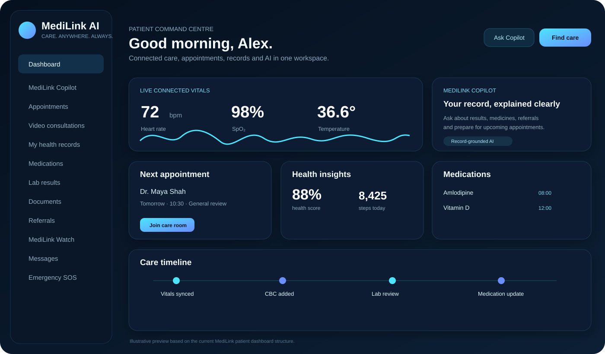

# MediLink AI

<div align="center">

# 🩺 MediLink AI
### Connected care. Clinical intelligence. Remote monitoring. One platform.

<p>
  <strong>A full-stack healthcare engineering platform combining patient care, clinician workflows, telehealth, IoT monitoring, hospital operations, secure messaging and record-grounded AI.</strong>
</p>

<p>
  <a href="https://medilink-ai-eight.vercel.app"></a>
  <a href="https://medilink-ai-api.onrender.com"></a>
  
  
  
</p>

<p>
  <a href="https://medilink-ai-eight.vercel.app"><b>🌐 Open MediLink</b></a>
  &nbsp;•&nbsp;
  <a href="https://medilink-ai-api.onrender.com/docs"><b>📚 API Docs</b></a>
</p>

</div>

---

> [!IMPORTANT]
> MediLink AI is an **engineering and portfolio project**. It is **not a clinically validated medical device**, not a substitute for a clinician, and should not be used for real-world diagnosis or emergency decision-making. The platform is designed around synthetic/test data and software-engineering demonstrations.

---

## ✨ What is MediLink AI?

MediLink AI is a multi-role healthcare platform designed around one idea:

> **A patient, clinician and hospital operations team should be able to move through care without losing context.**

The platform brings together:

- patient health records
- doctor discovery and appointment workflows
- secure authentication
- clinician worklists and patient queues
- AI-assisted care navigation
- record-grounded patient and clinical copilots
- telehealth video rooms
- live/streamed wearable observations
- medication and laboratory workflows
- referrals and documents
- emergency access flows
- secure messaging
- audit history
- hospital operations dashboards
- capacity and patient-flow monitoring
- platform health and background-job controls
- FHIR-style interoperability endpoints
- model-registry and AI-governance surfaces

The system uses a **Next.js frontend**, a **FastAPI backend**, SQLAlchemy persistence, WebSockets/WebRTC for realtime workflows, and an AI layer designed to keep retrieved records separate from generated reasoning.

---

# 🖥️ Interface Preview

## Patient command centre

The patient experience combines upcoming care, connected vitals, medication context, health records and MediLink Copilot in one dashboard.



<sub>Illustrative preview based on the current patient dashboard structure and components in the repository.</sub>

### Patient experience

| Area | What it does |
|---|---|
| **Dashboard** | Presents appointments, connected-health status, health insights, medication context and recent care events. |
| **MediLink Copilot** | Helps explain record information, prepare for appointments and navigate to appropriate care pathways. |
| **Doctor discovery** | Supports clinician search, doctor matching and appointment booking. |
| **Health records** | Surfaces labs, medications, timeline events and uploaded documents. |
| **MediLink Watch** | Displays connected vital signs and monitoring alerts. |
| **Telehealth** | Creates authenticated browser-based consultation rooms. |
| **Messages** | Provides a dedicated care-team communication workspace. |
| **Emergency support** | Provides fast emergency actions without delegating emergency decisions to AI. |

---

## Clinician command centre

The doctor workspace is designed around a clinical flow:

**queue → record → monitoring → care action → consultation → documentation**


<sub>Illustrative preview based on the current clinician dashboard structure and components in the repository.</sub>

### Clinical workspace

The clinician surface includes:

- patient queue and scheduled consultations
- recently active patients
- clinical records
- remote monitoring
- care actions
- clinical alerts
- secure video consultation rooms
- clinical notes
- referrals
- secure messaging
- clinician worklists
- record-grounded Clinical Copilot

The dashboard is role-protected and uses the authenticated clinician session to load appointments, patients, alerts and monitoring context.

---

## Hospital operations centre

Administrators receive an operational view across service activity and capacity.


<sub>Illustrative preview based on the current admin dashboard structure and components in the repository.</sub>

### Operations intelligence

The admin dashboard includes:

- patient and clinician counts
- appointment volume
- signed clinical-note activity
- current occupancy
- waiting-room load
- open appointment capacity
- departmental workload
- operational activity feeds
- care-network status
- audit history
- platform controls
- model/governance surfaces

---

# 🧠 MediLink Intelligence

MediLink contains multiple intelligence layers rather than treating every AI task as the same problem.

## 1. Record-grounded Copilot

The Copilot retrieves information from the authenticated user's MediLink context before generating a response.

Supported patient workflows include:

- explaining recent laboratory results
- reviewing recorded medicines
- preparing for an upcoming appointment
- checking referrals
- summarising available record context
- suggesting relevant specialties
- suggesting clinicians
- continuing previous Copilot conversations
- exposing record sources used for a response

The UI can show:

- answer
- record sources
- highlights
- suggested next steps
- suggested specialties
- clinician matches
- urgency state
- model/provider metadata where configured

This makes the experience more transparent than a generic standalone chatbot.

## 2. Specialty routing

A dedicated ML routing layer can map a care question toward an appropriate specialty.

The current test evaluation documented for the routing model uses synthetic/test examples and should **not** be interpreted as clinical validation.

| Metric | Test result |
|---|---:|
| Accuracy | 93.85% |
| Macro F1 | 93.98% |
| Weighted F1 | 93.92% |
| Top-2 accuracy | 95.38% |
| Log loss | 0.5805 |
| Test examples | 65 |
| Specialties | 10 |

## 3. Doctor matching

Doctor fit is presented as a **transparent /100 matching score** based on routing and available clinician attributes.

It is **not a medical probability** and is not presented as a diagnosis.

## 4. Safety boundary

Urgent screening is kept separate from the generative layer. The AI is not responsible for deciding whether an ambulance should be called.

Emergency actions are deterministic and user-controlled.

---

# ⌚ MediLink Watch & Connected Care

MediLink includes a connected-health workspace for streamed observations such as:

- heart rate
- oxygen saturation
- temperature
- blood pressure
- activity/steps
- battery state
- monitoring status
- anomaly/threshold alerts

The current project can generate or simulate observations through the backend for development and integration testing.

> [!NOTE]
> Generated values must not be represented as readings from a physical medical device. The current software demonstrates the **data pathway, UI, alerting and connected-care architecture** before real sensor integration.

## Intended connected-device architecture

```text
Wearable / Sensor
       │
       ├── BLE / Wi‑Fi
       │
       ▼
Device Gateway
       │
       ├── MQTT / HTTPS / WebSocket
       ▼
MediLink API
       │
       ├── Observation storage
       ├── Threshold / anomaly checks
       └── Realtime updates
       │
       ▼
Patient + Clinician dashboards
```

---

# 🎥 Secure Telehealth

MediLink includes a browser telehealth implementation using:

- authenticated care-room creation
- room IDs and join codes
- browser camera and microphone permissions
- WebRTC peer connections
- authenticated WebSocket signalling
- ICE/STUN negotiation
- participant state
- mute/unmute
- camera on/off
- call termination

Current STUN configuration includes Google's public STUN service.

For a production-grade deployment, a TURN service and stronger room-scoped policy controls would be required.

```text
Browser A ───── encrypted WebRTC media ───── Browser B
    │                                           │
    └──── authenticated WebSocket signalling ───┘
                         │
                         ▼
                    FastAPI API
```

---

# 🏥 Clinical Workflows

MediLink goes beyond appointments and dashboards.

The backend exposes foundations and/or workflows for:

### Clinical documentation
- clinical notes
- SOAP-style documentation
- note review
- signed-note tracking
- clinical letters

### Medication workflows
- medication lists
- prescribing workflows
- medication interaction review
- patient medication views

### Laboratory workflows
- lab orders
- result review
- patient result presentation
- clinician worklists

### Referrals
- referral creation
- referral queue
- patient referral visibility
- operational referral handling

### Risk & care actions
- care actions
- risk stratification surfaces
- clinical alerts
- worklist prioritisation

---

# 🏢 Hospital & Multi-Facility Operations

The operations layer is designed for hospital-network coordination.

Capabilities represented across the codebase include:

- multi-facility operations
- bed/capacity management
- staff roster concepts
- patient-flow monitoring
- waiting-room activity
- department load
- open-slot visibility
- referral queues
- governance exports
- audit history
- platform-health views

---

# 🔄 Interoperability & Platform Engineering

MediLink includes a platform control surface and backend APIs for production-oriented architecture.

Current engineering features include:

- SQLAlchemy database layer
- PostgreSQL-ready configuration
- SQLite local fallback
- Redis configuration with in-process fallback
- background job API
- object-storage abstraction
- Alembic-ready migration workflow
- FHIR R4-style resource endpoint
- model registry
- drift-monitoring surfaces
- MQTT configuration
- platform status endpoints

Example FHIR-style endpoint:

```text
GET /api/v1/fhir/Patient/{patient_id}
```

---

# 🔐 Authentication & Access Control

MediLink currently supports:

- email/password registration
- password hashing
- JWT sessions
- role-aware dashboards
- protected routes
- Patient / Doctor / Admin roles
- Google Identity token verification
- external identity linking foundation

Admin accounts cannot be self-registered through the standard registration endpoint.

## Role model

```text
                 ┌─────────────┐
                 │   MediLink  │
                 │    Auth     │
                 └──────┬──────┘
                        │
       ┌────────────────┼────────────────┐
       │                │                │
       ▼                ▼                ▼
   Patient           Doctor           Admin
       │                │                │
 Personal care    Clinical care    Operations
 Records          Patient queue    Capacity
 Copilot          Monitoring       Governance
 Telehealth       Notes/actions    Platform
```

---

# 🏗️ System Architecture

```text
┌───────────────────────────────────────────────────────────────┐
│                        CLIENT LAYER                           │
│                                                               │
│  Next.js 16 / React                                          │
│  Patient UI · Doctor UI · Admin UI · Copilot · Telehealth    │
└───────────────────────────────┬───────────────────────────────┘
                                │ HTTPS / WebSocket
                                ▼
┌───────────────────────────────────────────────────────────────┐
│                         API LAYER                             │
│                                                               │
│                         FastAPI                               │
│                                                               │
│ Auth │ Care │ Clinical │ AI │ IoT │ Messaging │ Platform     │
└───────────────┬───────────────────────┬───────────────────────┘
                │                       │
                ▼                       ▼
      ┌──────────────────┐    ┌────────────────────────┐
      │ Persistence      │    │ Intelligence           │
      │ SQLAlchemy       │    │ Record retrieval       │
      │ SQLite / PG      │    │ Specialty routing      │
      │ Documents        │    │ LLM provider layer     │
      └──────────────────┘    │ Model registry         │
                              └────────────────────────┘
                │
                ▼
      ┌──────────────────┐
      │ Realtime / IoT   │
      │ WebSockets       │
      │ WebRTC signalling│
      │ MQTT-ready       │
      └──────────────────┘
```

---

# 🧰 Technology Stack

### Frontend
- Next.js 16
- React
- TypeScript
- Lucide React
- responsive custom UI
- browser WebRTC APIs
- browser WebSocket APIs

### Backend
- Python
- FastAPI
- Pydantic
- SQLAlchemy
- JWT authentication
- Google Identity verification
- WebSocket endpoints
- PDF/document processing
- background-job interfaces

### AI / ML
- record-grounded retrieval
- TF-IDF retrieval/routing components
- logistic-regression specialty routing
- calibration
- optional LLM provider layer
- model registry
- drift/governance surfaces

### Infrastructure
- Vercel — frontend
- Render — API
- Docker / Docker Compose
- PostgreSQL-ready configuration
- Redis-ready configuration
- MQTT-ready configuration

---

# 🌍 Live Deployment

| Service | URL | Purpose |
|---|---|---|
| **Frontend** | https://medilink-ai-eight.vercel.app | Production Next.js application |
| **Backend** | https://medilink-ai-api.onrender.com | FastAPI service |
| **API docs** | https://medilink-ai-api.onrender.com/docs | OpenAPI / Swagger documentation |

The production frontend reads the backend URL from:

```env
NEXT_PUBLIC_API_URL=https://medilink-ai-api.onrender.com
```

---

# 🚀 Run Locally

## 1. Clone

```bash
git clone https://github.com/Edgar-50/medilink-ai.git
cd medilink-ai
```

## 2. Backend

Windows PowerShell:

```powershell
cd backend
python -m venv .venv
.\.venv\Scripts\python.exe -m pip install -r requirements.txt
```

Create:

```text
backend/.env
```

Example development configuration:

```env
DATABASE_URL=sqlite:///./medilink.db
SECRET_KEY=replace-with-a-secure-random-secret
ACCESS_TOKEN_EXPIRE_MINUTES=60
FRONTEND_ORIGIN=http://localhost:3000
GOOGLE_CLIENT_ID=your-google-client-id
```

Run:

```powershell
.\.venv\Scripts\python.exe -m uvicorn app.main:app --reload --reload-dir app
```

Backend:

```text
http://127.0.0.1:8000
```

Docs:

```text
http://127.0.0.1:8000/docs
```

## 3. Frontend

```powershell
cd frontend
npm.cmd install
npm.cmd run dev
```

Create:

```text
frontend/.env.local
```

```env
NEXT_PUBLIC_API_URL=http://127.0.0.1:8000
NEXT_PUBLIC_GOOGLE_CLIENT_ID=your-google-client-id
```

Open:

```text
http://localhost:3000
```

---

# 🐳 Docker

The repository includes Docker-oriented infrastructure for running platform dependencies.

Typical development flow:

```bash
docker compose up --build
```

Depending on the selected compose stack, services can include:

- API
- PostgreSQL
- Redis
- MQTT

---

# 🔑 Optional LLM Configuration

LLM credentials belong **only on the backend**.

Example:

```env
LLM_PROVIDER=openai
OPENAI_API_KEY=your-secret-key
OPENAI_MODEL=your-enabled-model
LLM_ALLOW_RECORD_CONTEXT=true
LLM_TIMEOUT_SECONDS=30
```

Never commit keys to GitHub and never expose them through `NEXT_PUBLIC_*` variables.

If no configured LLM provider is available, the application is designed to preserve deterministic/record-grounded fallbacks where implemented.

---

# 📂 Repository Structure

```text
medilink-ai/
│
├── backend/
│   ├── app/
│   │   ├── core/           # config, database, security
│   │   ├── models/         # persistence models
│   │   ├── routers/        # API modules
│   │   ├── schemas/        # request / response schemas
│   │   └── services/       # supporting logic
│   ├── ml/
│   │   └── artifacts/
│   ├── storage/
│   ├── requirements.txt
│   └── .env.example
│
├── frontend/
│   ├── app/
│   │   ├── dashboard/
│   │   │   ├── patient/
│   │   │   ├── doctor/
│   │   │   └── admin/
│   │   ├── copilot/
│   │   ├── video/
│   │   ├── watch/
│   │   ├── records/
│   │   ├── labs/
│   │   ├── medications/
│   │   └── ...
│   ├── components/
│   └── lib/
│
├── docs/
│   ├── screenshots/
│   └── architecture / roadmap notes
│
├── docker-compose*.yml
└── README.md
```

---

# 🛡️ Security Design

Security-related engineering represented in the current project includes:

- password hashing
- JWT-based sessions
- role-based route protection
- authenticated backend endpoints
- Google token verification
- protected care-room creation
- authenticated WebSocket signalling
- browser-controlled camera/microphone access
- audit-history support
- explicit frontend/backend origin configuration
- server-side secret storage

For a real healthcare deployment, additional requirements would include formal threat modelling, penetration testing, key-management infrastructure, data-retention policy, access reviews, regulatory assessment and independently validated security controls.

---

# ⚠️ Healthcare & AI Safety

MediLink intentionally avoids presenting its AI layer as autonomous medical authority.

### The project is designed around these rules:

1. **AI supports decisions — it does not replace clinicians.**
2. **Urgent escalation remains deterministic rather than LLM-driven.**
3. **Doctor match scores are ranking signals, not probabilities of medical correctness.**
4. **Model metrics are engineering/test metrics, not clinical-performance claims.**
5. **Generated wearable values must not be represented as physical sensor measurements.**
6. **Record-grounded answers should distinguish stored patient facts from general information.**
7. **Emergency actions stay explicit and user-controlled.**

For UK-oriented emergency flows, the interface directs users toward **999** for emergencies and **NHS 111** for urgent advice where appropriate.

---

# 🧪 Current Engineering Status

| Area | Status |
|---|---|
| Next.js production frontend | ✅ Deployed |
| FastAPI backend | ✅ Deployed |
| Patient dashboard | ✅ Implemented |
| Doctor dashboard | ✅ Implemented |
| Admin dashboard | ✅ Implemented |
| Email/password auth | ✅ Implemented |
| Google sign-in | ✅ Implemented |
| Appointment workflows | ✅ Implemented |
| Record-grounded Copilot | ✅ Implemented |
| Specialty routing | ✅ Implemented |
| WebRTC consultation rooms | ✅ Implemented |
| Authenticated signalling | ✅ Implemented |
| Connected-health dashboard | ✅ Implemented |
| Messaging / care workflows | ✅ Implemented |
| Platform control surfaces | ✅ Implemented |
| FHIR-style Patient endpoint | ✅ Implemented |
| Production TURN infrastructure | ⏳ Future hardening |
| Physical wearable integration | ⏳ Future integration |
| Formal clinical validation | ❌ Not performed |
| Medical-device certification | ❌ Not claimed |

---

# 🗺️ Roadmap

### Near-term engineering
- persistent PostgreSQL production data
- migration hardening
- Redis-backed distributed services
- durable object storage
- production TURN infrastructure
- stronger room-level telehealth authorization
- real sensor gateway integration
- expanded audit and consent policies

### Intelligence
- richer record retrieval
- stronger citation traceability
- clinician-configurable safety rules
- model-version comparison
- drift dashboards
- evaluation pipelines
- structured clinical summarisation

### Interoperability
- expand FHIR-style resources beyond Patient
- terminology mappings
- import/export workflows
- external EHR integration adapters

---

# 🤝 Contributing

This repository is primarily a personal engineering project, but structured contributions, issues and architecture suggestions are welcome.

Good contribution areas include:

- accessibility
- testing
- UI/UX
- interoperability
- observability
- security hardening
- realtime reliability
- clinical workflow modelling
- ML evaluation tooling

---

# 👨‍💻 Engineering Focus

MediLink AI is built to demonstrate how modern software architecture can connect:

**full-stack engineering + healthcare workflows + ML + LLM orchestration + realtime systems + IoT + platform operations**

without hiding the distinction between:

- prototype vs production
- generated data vs sensor data
- test metrics vs clinical evidence
- AI assistance vs clinical judgment

---

<div align="center">

### MediLink AI

**Care. Anywhere. Always.**

Built as a connected-health engineering platform.

[Open the live application](https://medilink-ai-eight.vercel.app) · [Explore the API](https://medilink-ai-api.onrender.com/docs)

</div>
